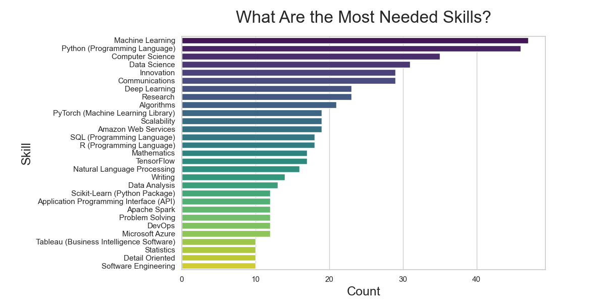
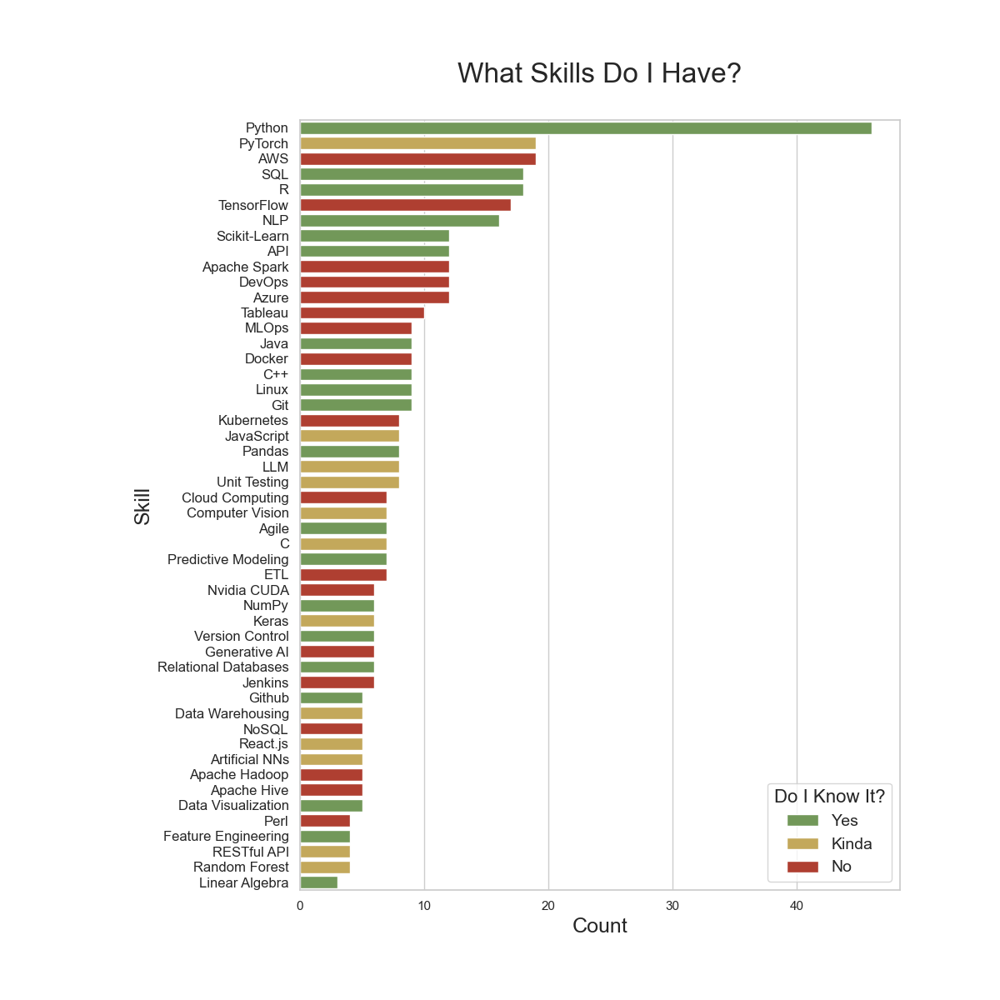
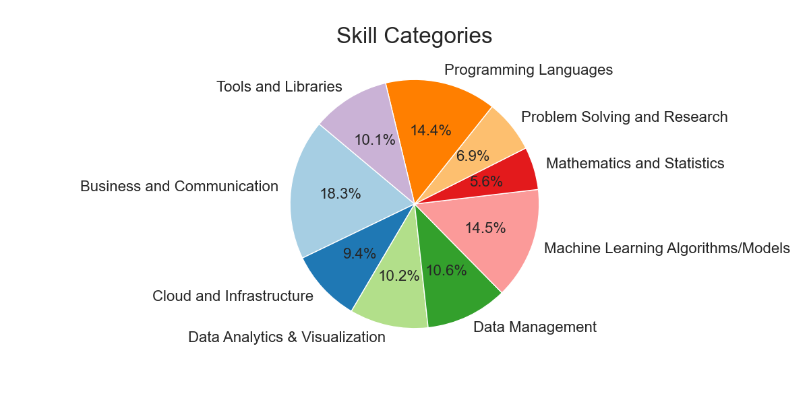
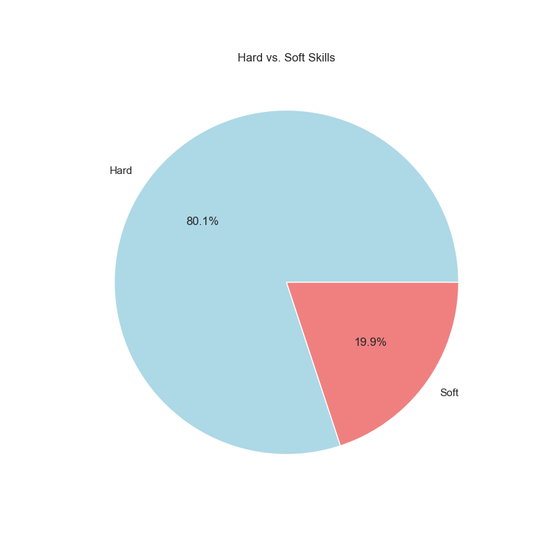

# Job Skills Mining and Analysis

## Table of Contents
1. [Overview](#overview)
    - [Key Objectives](#key-objectives)
    - [Technologies Used](#technologies-used)
2. [Project Structure](#project-structure)
3. [Get Started](#get-started)
5. [Results](#results)
6. [Challenges](#challenges)
7. [Lessons Learned](#lessons-learned)
8. [Acknowledgments](#acknowledgments)

## Overview
Have you ever wondered which skills are in demand in the job market? Are you looking to enhance your skill set for a specific career path? Look no further! This project is all about automating the process of extracting skills from job listings on Indeed, categorizing them, and diving deep into data analysis to uncover valuable insights.

### Key Objectives
- 🔍 **Web Scraping Indeed:** I kick things off by scraping job listings from Indeed using a webdriver.
- 🛠️ **Skill Identification:** Next, I use the Lightcast API, a nifty service that identifies and extracts specific skills and keywords from text, especially tailored for job-related data.
- 🧩 **Skill Categorization:** After skill extraction, I use the ChatGPT API to automatically categorize these skills. This categorization step helps organize the skills into broader categories, making the data more manageable and interpretable.
- 📊 **Data Analysis:** Finally, I analyze the data to glean valuable insights into the skills currently sought after in the job market.

### Technologies Used
#### Web Scraping:
- **Selenium:** Selenium is a powerful web automation tool that allows you to interact with web pages and automate various tasks, including web scraping. In this project, I used Selenium to control the web browser and navigate the Indeed website.
#### APIs:
- **ChatGPT API:** This API from OpenAI allows you to interact with the ChatGPT model programmatically, providing prompts and receiving responses for various natural language processing tasks, such as categorization.
- **Lightcast API:** Lightcast is a service that specializes in natural language processing and information extraction. It helps identify and extract specific skills mentioned within job descriptions.
#### Other Tools:
- **matplotlib, seaborn, numpy, pandas:** These power our data visualization and manipulation.

## Project Structure
- 📂 **data:** storage for jobs information, skills, and their categories
- 📂 **figures:** data visualizations
- 📂 **src**
    - 📂 **analysis**
        - 📄 **`visualization.py`:** generates data visualizations
    - 📂 **categorization**
        - 📄 **`categorizer.py`:** categorizes skills
    - 📂 **scraping**
        - 📄 **`skill_scraper.py`:** extracts skills from job descriptions
        - 📄 **`web_scraper.py`:** scraping job posting from Indeed
    - 📄 **`main.py`:** main project script
    - 📄 **`utils.py`:** utility functions
- 📄 **.env:** API key storage
- 📄 **requirements.txt:** project dependencies

## Get Started
Ready to dive in? Here's what you need to do:

1. Install dependencies with `pip install -r requirements.txt`.
2. Run `main.py` and don't forget to uncomment the functions you want to use. 
3. Customize your skill categories by tweaking `SKILL_CATEGORY_PROMPT_HEADER` in `categorizer.py`.

## Results
### What are the most frequently mentioned skills?
I began by searching for positions similar to 'Machine Learning Engineer' and 'Data Scientist' in my area. I gathered data from around 150 job postings, filtering out duplicates and positions that didn't align with my goals. After this manual curation, I narrowed it down to 50 relevant job listings.
From these job descriptions, I extracted the most frequently mentioned skills and visualized them in a bar plot below.

### What skills am I lacking?
Many of these skills were quite broad. My main aim with this project was to identify specific, learnable skills that I needed to focus on. I created a plot highlighting the top 50 skills, color-coded to indicate my proficiency in each.

📗 **Skills I know:** &emsp;&emsp;&emsp;&emsp;&emsp; Python, SQL, R, NLP, Sckikit-learn, APIs, Java, C++, Linux, Git, Pandas, Agile, Numpy, Version Control, ...

📒 **Skills I need to practice:**   &nbsp; PyTorch, JavaSCript, LLM, Unit Testing, Computer Vision, C, Keras, Data Warehousing, React, Artificial NNs
  
📕 **Skills I need to learn:**  &emsp;&nbsp;&nbsp;     AWS, Apache Spark, DevOps, Azure, Tableau, MLOps, Docker, Kubernetes, Cloud Computing, ETL, Nvidia CUDA  

### What types of skills are jobs looking for?
I then organized these skills using ChatGPT, categorizing them into "hard" vs. "soft" skills and placing them in broader skill categories specific to my field.

## Challenges
- 🛡️ **Captchas:**: While scraping data from Indeed, I encountered security measures that triggered captchas, requiring me to implement random waiting times between actions to simulate human-like behavior.
- 💡 **Prompt Engineering:** Crafting effective prompts for ChatGPT proved to be more challenging than expected. Ensuring clarity and specificity in the prompts is crucial to minimize response variability and prevent data formatting issues.
- ⚙️ **API Performance:** ChatGPT's API performance is a bit sluggish for regular users, leading to longer category generation times. Additionally, server overloads may occasionally disrupt the process.

## Lessons Learned
- 🔑 **Explore APIs First:** It's advisable to explore existing APIs before resorting to web scraping. I later discovered that Indeed offers its own API, although I couldn't actually use it due to significant restrictions. Nevertheless, it could have simplified the project considerably if I had been able to use it.
- 🔒 **Secure Your Keys:** Avoid hardcoding API keys directly into your code. I made the mistake of inadvertently committing my API keys in the early stages of development. To fix this, I securely stored them in a .env file, which is loaded into the main files while keeping it excluded from version control.

## Acknowledgments
- [Lightcast's](https://lightcast.io/) API
- [OpenAI's](https://openai.com/blog/chatgpt) ChatGPT API
