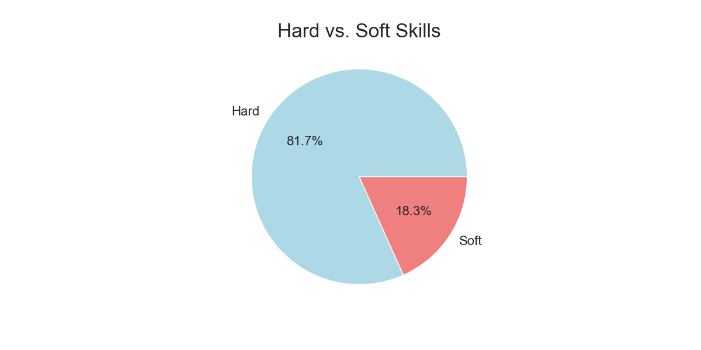

# Job Skills Mining and Analysis

## Overview
This project aims to automate the process of extracting skills from job listings on Indeed, categorizing these skills, and performing data analysis on the extracted skills and their respective categories.

### Key Objectives
1. **Web Scraping Indeed:** I start by scraping job listings from the Indeed job board using a selenium webdriver.
2. **Skills Extraction with Lightcast API:** Next, I utilize the Lightcast API to extract skills from the job descriptions. Lightcast is a service that helps identify and extract specific skills and keywords from text, which is particularly useful for job-related data.
3. **Skills Categorization with ChatGPT API:** After extracting skills, I employ the ChatGPT API to automatically categorize these skills. This categorization step helps organize the skills into broader skill categories or domains, making it easier to analyze and interpret the data.
4. **Data Analysis:** Finally, I conduct data analysis to gain insights into the skills demand within the job market.

### Technologies Used
#### Web Scraping:
- **Selenium:** Selenium is a powerful web automation tool that allows you to interact with web pages and automate various tasks, including web scraping. In this project, I used Selenium to control the web browser and navigate the Indeed website.
#### APIs:
- **ChatGPT API:** This API from OpenAI allows you to interact with the ChatGPT model programmatically, providing prompts and receiving responses for various natural language processing tasks, such as categorization.
- **Lightcast API:** Lightcast is a service that specializes in natural language processing and information extraction. It helps identify and extract specific skills mentioned within job descriptions.
  
**Other:** matplotlib, seaborn, numpy, pandas

## Project Structure
```
.
├── data                       # Data storage
├── figures                    # Data visualizations
├── src
│   ├── analysis
|   |   └── visualization.py   # Generates data visualizations
|   |
│   ├── categorization
|   |   └── categorizer.py     # Categories skills
|   |
|   └── scraping
|   |   ├── skill_scraper.py   # Extracts skills from job descriptions
|   |   └── web_scraper.py     # Scrapes Indeed for job postings
|   |
|   ├── main.py                # Main project script
|   └── utils.py               # Utility functions
|
├── .env                       # API keys
├── .gitignore
├── README.md
└── requirements.txt           # Project dependencies
```

## Installation
`pip install -r requirements.txt`

## Usage
Run `main.py`, uncommenting the functions you wish to call (scraping data, exctracting skills, or visualizing the data).

## Results




## Lessons Learned
TODO

## Acknowledgments
TODO
